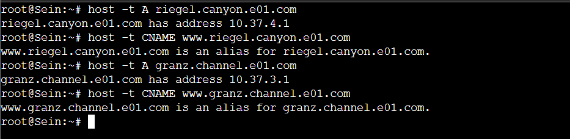
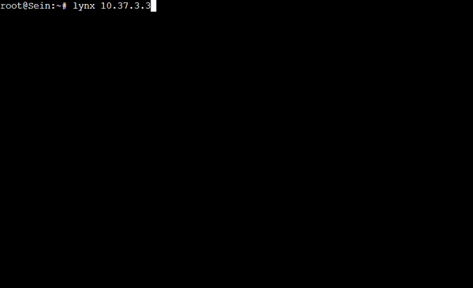
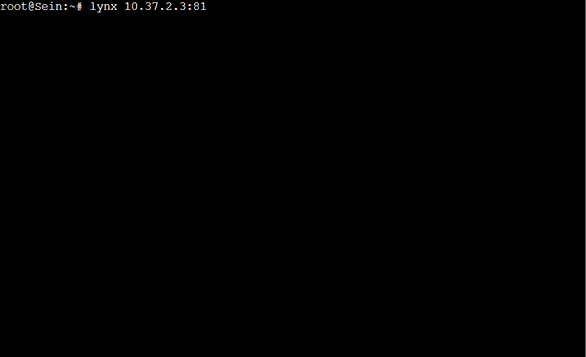
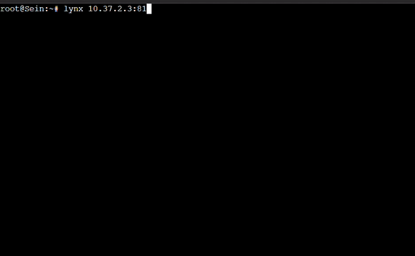
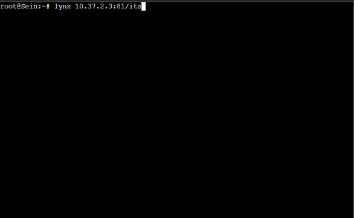
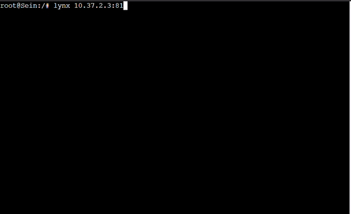
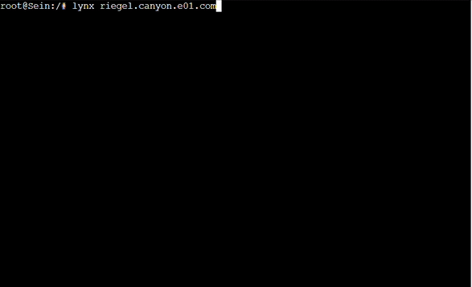

# Jarkom-Modul-3-E01-2023

## GRIMOIRE
[E01_GRIMOIRE](https://docs.google.com/document/d/1zOLhUjCq4XP3cVdAw3ziiaPz9WUXaViw4doPoGYnwpw/edit?usp=sharing)

## [prefix IP]
10.37.X.X

## Topology


## Ketentuan Node
Node | Kategori | Image Docker | Konfigurasi IP
---- | -------- | ------------ | --------------
Aura | Router (DHCP Relay) | danielcristh0/debian-buster:1.1 | Dynamic
Himmel | DHCP Server | danielcristh0/debian-buster:1.1 | Static
Heiter | DNS Server | danielcristh0/debian-buster:1.1 | Static
Denken | Database Server | danielcristh0/debian-buster:1.1 | Static
Eisen | Load Balancer | danielcristh0/debian-buster:1.1 | Static
Frieren | Laravel Worker | danielcristh0/debian-buster:1.1 | Static
Flamme | Laravel Worker | danielcristh0/debian-buster:1.1 | Static
Fern | Laravel Worker | danielcristh0/debian-buster:1.1 | Static
Lawine | PHP Worker | danielcristh0/debian-buster:1.1 | Static
Linie | PHP Worker | danielcristh0/debian-buster:1.1 | Static
Lugner | PHP Worker | danielcristh0/debian-buster:1.1 | Static
Revolte | Client | danielcristh0/debian-buster:1.1 | Dynamic
Richter | Client | danielcristh0/debian-buster:1.1 | Dynamic
Sein | Client | danielcristh0/debian-buster:1.1 | Dynamic
Stark | Client | danielcristh0/debian-buster:1.1 | Dynamic


## 0
### *Kalian diminta untuk melakukan register domain berupa **riegel.canyon.yyy.com** untuk worker Laravel dan **granz.channel.yyy.com** untuk worker PHP, mengarah pada worker yang memiliki IP [prefix IP].x.1.*

### **Konfigurasi DNS server (Heiter)**

Pertama, buat file konfigurasi untuk domain **riegel.canyon.yyy.com** dan **granz.channel.yyy.com**

* _/etc/bind/e01/riegel.canyon.e01.com_
```bash
;
; BIND data file for local loopback interface
;
$TTL    604800
@       IN      SOA     riegel.canyon.e01.com. root.riegel.canyon.e01.com. (
                              2         ; Serial
                         604800         ; Refresh
                          86400         ; Retry
                        2419200         ; Expire
                         604800 )       ; Negative Cache TTL
;
@       IN      NS      riegel.canyon.e01.com.
@       IN      A       10.37.4.1
www     IN      A       riegel.canyon.e01.com.
```

* _/etc/bind/e01/granz.channel.e01.com_
```bash
;
; BIND data file for local loopback interface
;
$TTL    604800
@       IN      SOA     granz.channel.e01.com. root.granz.channel.e01.com. (
                              2         ; Serial
                         604800         ; Refresh
                          86400         ; Retry
                        2419200         ; Expire
                         604800 )       ; Negative Cache TTL
;
@       IN      NS      granz.channel.e01.com.
@       IN      A       10.37.3.1
www     IN      A       granz.channel.e01.com.
```
<br>

Kemudian tambahkan konfigurasi zone untuk tiap domain

* _/etc/bind/named.conf.local_
```c
zone "riegel.canyon.e01.com" {
	type master;
	file "/etc/bind/e01/riegel.canyon.e01.com";
};

zone "granz.channel.e01.com" {
	type master;
	file "/etc/bind/e01/granz.channel.e01.com";
};
```
<br>

Agar client dapat terhubung ke internet perlu ditambahkan konfigurasi forwarder dengan IP DNS milik Router

* _/etc/bind/named.conf.options_

```c
options {
        directory "/var/cache/bind";

        forwarders {
            192.168.122.1;
        };

        //dnssec-validation auto;
        allow-query { any; };
        listen-on-v6 { any; };
};
```
<br>

Restart Bind9 untuk mengaktifkan konfigurasi yang sudah dibuat

```bash
service bind9 restart
```

### Bukti pengecekan



## 1 2 3 4 5
Pengerjaan soal 2, 3, 4, dan 5 berada pada konfigurasi DHCP server dan relay

### 1. *Lakukan konfigurasi sesuai dengan peta yang sudah diberikan.*

```bash
host Lawine {
    hardware ethernet c6:2b:76:e6:73:3b;
    fixed-address 10.37.3.1;
}

host Linie {
    hardware ethernet 16:88:9f:6a:81:1e;
    fixed-address 10.37.3.3;
}

host Lugner {
    hardware ethernet e6:34:06:30:c5:3d;
    fixed-address 10.37.3.4;
}

host Frieren {
    hardware ethernet 3a:d2:4e:43:3e:e9;
    fixed-address 10.37.4.1;
}

host Flamme {
    hardware ethernet ea:69:d5:89:14:be;
    fixed-address 10.37.4.3;
}

host Fern {
    hardware ethernet 32:11:a8:d8:c6:bf;
    fixed-address 10.37.4.4;
}
```

### 2. *Client yang melalui Switch3 mendapatkan range IP dari [prefix IP].3.16 - [prefix IP].3.32 dan [prefix IP].3.64 - [prefix IP].3.80*

* _block subnet 10.37.3.0_
```bash
    range 10.37.3.16 10.37.3.32;
    range 10.37.3.64 10.37.3.80;
    option routers 10.37.3.2;
    option broadcast-address 10.37.3.255;
```

### 3. *Client yang melalui Switch4 mendapatkan range IP dari [prefix IP].4.12 - [prefix IP].4.20 dan [prefix IP].4.160 - [prefix IP].4.168*

* _block subnet 10.37.4.0_
```bash
    range 10.37.4.12 10.37.4.20;
    range 10.37.4.160 10.37.4.168;
    option routers 10.37.4.2;
    option broadcast-address 10.37.4.255;
```

### 4. *Client mendapatkan DNS dari Heiter dan dapat terhubung dengan internet melalui DNS tersebut*

* _block subnet 10.37.3.0 dan 10.37.4.0_
```bash
    option domain-name-servers 10.37.1.3;
```

### 5. *Lama waktu DHCP server meminjamkan alamat IP kepada Client yang melalui Switch3 selama 3 menit sedangkan pada client yang melalui Switch4 selama 12 menit. Dengan waktu maksimal dialokasikan untuk peminjaman alamat IP selama 96 menit*

* _block subnet 10.37.3.0_
```bash
    default-lease-time 180;
    max-lease-time 5760;
```

* _block subnet 10.37.4.0_
```bash
    default-lease-time 720;
    max-lease-time 5760;
```

### Full DHCP server Config

* _/etc/dhcp/dhcpd.conf_
```bash
subnet 10.37.1.0 netmask 255.255.255.0 {
}

subnet 10.37.2.0 netmask 255.255.255.0 {
}

subnet 10.37.3.0 netmask 255.255.255.0 {
    range 10.37.3.16 10.37.3.32;
    range 10.37.3.64 10.37.3.80;
    option routers 10.37.3.2;
    option broadcast-address 10.37.3.255;
    option domain-name-servers 10.37.1.3;
    default-lease-time 180;
    max-lease-time 5760;
}

host Lawine {
    hardware ethernet c6:2b:76:e6:73:3b;
    fixed-address 10.37.3.1;
}

host Linie {
    hardware ethernet 16:88:9f:6a:81:1e;
    fixed-address 10.37.3.3;
}

host Lugner {
    hardware ethernet e6:34:06:30:c5:3d;
    fixed-address 10.37.3.4;
}

subnet 10.37.4.0 netmask 255.255.255.0 {
    range 10.37.4.12 10.37.4.20;
    range 10.37.4.160 10.37.4.168;
    option routers 10.37.4.2;
    option broadcast-address 10.37.4.255;
    option domain-name-servers 10.37.1.3;
    default-lease-time 720;
    max-lease-time 5760;
}

host Frieren {
    hardware ethernet 3a:d2:4e:43:3e:e9;
    fixed-address 10.37.4.1;
}

host Flamme {
    hardware ethernet ea:69:d5:89:14:be;
    fixed-address 10.37.4.3;
}

host Fern {
    hardware ethernet 32:11:a8:d8:c6:bf;
    fixed-address 10.37.4.4;
}
```
<br>

Selain konfigurasi untuk client, konfigurasi interface yang digunakan oleh dhcp server juga perlu ditambahkan

* _/etc/default/isc-dhcp-server_
```bash
INTERFACESv4="eth0"
INTERFACESv6=""
```

Restart service untuk mengaktifkan konfigurasi yang sudah dibuat

```bash
service isc-dhcp-server restart
```

### **Konfigurasi DHCP Relay (Aura)**

Sesuai topology yang sudah diberikan, terdapat DHCP relay yang perlu dikonfigurasi juga.

Pertama, atur ip DHCP server serta interface yang digunakan DHCP Relay

* _/etc/default/isc-dhcp-relay_
```bash
SERVERS="10.37.1.2"
INTERFACES="eth1 eth2 eth3 eth4"
OPTIONS=
```
<br>

Kemudian, tambahkan juga konfigurasi ip forwarding

* _/etc/sysctl.conf_
```bash
net.ipv4.ip_forward=1
```
<br>

Restart service untuk mengaktifkan konfigurasi yang sudah dibuat

```bash
service isc-dhcp-relay restart
```

## 6 
### *Pada masing-masing worker PHP, lakukan konfigurasi virtual host untuk website berikut dengan menggunakan php 7.3.*

### **Konfigurasi pada Worker php (Lawine, Linie, Lugner)**

Pertama Download terlebih dahulu project php yang akan di deploy
```bash
curl -L -o "php.zip" "https://drive.google.com/uc?export=download&id=1ViSkRq7SmwZgdK64eRbr5Fm1EGCTPrU1"
```
<br>

Kemudian, unzip dan pindahkan ke directory `/var/www/`

```bash
unzip php.zip
rm -rf php.zip
mv ./modul-3 /var/www/modul-3
```
<br>

Setelah itu, tambahkan file konfigurasi nginx baru

* _/etc/nginx/sites-available/e01_
```bash
server {
        listen 80;

        root /var/www/modul-3;

        index index.html index.htm index.nginx-debian.html index.php;

        server_name _;
        # server_name granz.channel.e01.com www.granz.channel.e01.com;

        location / {
                try_files $uri $uri/ /index.php?$query_string;
        }

        location ~ \.php$ {
                include snippets/fastcgi-php.conf;
                fastcgi_pass unix:/run/php/php7.3-fpm.sock;
        }

        location ~ /\.ht {
               deny all;
        }

        error_log /var/log/nginx/e01_error.log;
        access_log /var/log/nginx/e01_access.log;
}
```
>server_name digunakan pada worker dengan ip [Prefix IP].x.1

<br>

Untuk mengaktifkan konfigurasi yang telah dibuat lakukan link file konfigurasi baru menuju directory `/etc/nginx/sites-enabled/`, unlink konfigurasi lama, restart php-fpm, serta restart nginx

```bash
ln -s /etc/nginx/sites-available/e01 /etc/nginx/sites-enabled/
unlink /etc/nginx/sites-enabled/default
service nginx restart
service php7.3-fpm start
```

### Bukti Pengecekan


## 7
### *Kepala suku dari Bredt Region memberikan resource server sebagai berikut:<br>a. Lawine, 4GB, 2vCPU, dan 80 GB SSD.<br>b. Linie, 2GB, 2vCPU, dan 50 GB SSD.<br>c. Lugner 1GB, 1vCPU, dan 25 GB SSD.<br>aturlah agar Eisen dapat bekerja dengan maksimal, lalu lakukan testing dengan 1000 request dan 100 request/second.*

### **Konfigurasi pada Load Balancer (Eisen)**

Karena tiap worker memiliki spesifikasi yang berbeda, maka Load Balancer dapat menggunakan algoritma Weighted Round Robin agar lebih optimal

Weight dapat diberikan menyesuaikan spesifikasi worker (semakin kuat spesifikasi worker semakin besar weightnya)

Sehingga konfigurasi Load Balancer nginx dapat diatur seperti berikut,

* _/etc/nginx/sites-available/e01_
```bash
upstream backendphp  {
        server granz.channel.e01.com weight=14;
        server 10.37.3.3 weight=9;
        server 10.37.3.4 weight=5;
}

server {
        listen 81;
        server_name _;

        location / {
                proxy_pass http://backendphp;
                proxy_set_header    X-Real-IP $remote_addr;
                proxy_set_header    X-Forwarded-For $proxy_add_x_forwarded_for;
                proxy_set_header    Host $http_host;
        }

        error_log /var/log/nginx/lb_error.log;
        access_log /var/log/nginx/lb_access.log;
}
```
<br>

Untuk mengaktifkan konfigurasi yang telah dibuat lakukan link file konfigurasi baru menuju directory `/etc/nginx/sites-enabled/`, unlink konfigurasi lama, serta restart nginx

```bash
ln -s /etc/nginx/sites-available/e01 /etc/nginx/sites-enabled/
unlink /etc/nginx/sites-enabled/default
service nginx restart
```

### Bukti Pengecekan



### Testing

Laporan Load Testing dapat dilihat pada link berikut:

[e01_Grimoire/testing-7](https://docs.google.com/document/d/1zOLhUjCq4XP3cVdAw3ziiaPz9WUXaViw4doPoGYnwpw/edit#heading=h.kmebmfk5z0m7)

## 8
### *Karena diminta untuk menuliskan grimoire, buatlah analisis hasil testing dengan 200 request dan 10 request/second masing-masing algoritma Load Balancer dengan ketentuan sebagai berikut:<br>a. Nama Algoritma Load Balancer<br>b. Report hasil testing pada Apache Benchmark<br>c. Grafik request per second untuk masing masing algoritma.<br>d. Analisis*

Command:
```bash
ab -n 200 -c 10 http://10.37.2.3:81/
```

### I. Hasil Testing
#### a. ROUND ROBIN

[e01_Grimoire/testing-8/I/Round-Robin](https://docs.google.com/document/d/1zOLhUjCq4XP3cVdAw3ziiaPz9WUXaViw4doPoGYnwpw/edit#heading=h.42qg9tiyv0m1)

#### b. WEIGHTED ROUND ROBIN

[e01_Grimoire/testing-8/I/Weighted-Round-Robin](https://docs.google.com/document/d/1zOLhUjCq4XP3cVdAw3ziiaPz9WUXaViw4doPoGYnwpw/edit#heading=h.osy0e29po7y1)

#### c. LEAST CONNECTION

[e01_Grimoire/testing-8/I/Least-Connection](https://docs.google.com/document/d/1zOLhUjCq4XP3cVdAw3ziiaPz9WUXaViw4doPoGYnwpw/edit#heading=h.9qe2unw654ej)

#### d. IP HASH

[e01_Grimoire/testing-8/I/IP-Hash](https://docs.google.com/document/d/1zOLhUjCq4XP3cVdAw3ziiaPz9WUXaViw4doPoGYnwpw/edit#heading=h.pxdah2fvu2dv)

#### e. GENERIC HASH

[e01_Grimoire/testing-8/I/IP-Hash](https://docs.google.com/document/d/1zOLhUjCq4XP3cVdAw3ziiaPz9WUXaViw4doPoGYnwpw/edit#heading=h.od53qydk5v9d)

### II. Grafik

[e01_Grimoire/testing-8/II/Grafik](https://docs.google.com/document/d/1zOLhUjCq4XP3cVdAw3ziiaPz9WUXaViw4doPoGYnwpw/edit#heading=h.r3ze0vu6ay1n)

### III. Analisis

_"Dari data yang didapat, algoritma terbaik didapatkan dari algoritma yang memiliki Request Per Second terbesar yaitu Generic Hash. Perlu diperhatikan bahwa tiap algoritma diuji 1 kali uji 200 request dengan kecepatan 10 request/second, sehingga hasil yang didapatkan kurang akurat dikarenakan sampel uji yang kecil dan tiap perulangan uji menghasilkan hasil yang berbeda di range 300 - 450 Request/second untuk semua algoritma."_

sumber: [e01_Grimoire/testing-8/III/Analisis](https://docs.google.com/document/d/1zOLhUjCq4XP3cVdAw3ziiaPz9WUXaViw4doPoGYnwpw/edit#heading=h.o53ieha6u1a3)

## 9
### *Dengan menggunakan algoritma Round Robin, lakukan testing dengan menggunakan 3 worker, 2 worker, dan 1 worker sebanyak 100 request dengan 10 request/second, kemudian tambahkan grafiknya pada grimoire.*

### 3 Worker

[e01_Grimoire/testing-9/3-worker](https://docs.google.com/document/d/1zOLhUjCq4XP3cVdAw3ziiaPz9WUXaViw4doPoGYnwpw/edit#heading=h.pssryhxck03f)

### 2 Worker

[e01_Grimoire/testing-9/2-worker](https://docs.google.com/document/d/1zOLhUjCq4XP3cVdAw3ziiaPz9WUXaViw4doPoGYnwpw/edit#heading=h.8no2zvo8jhps)

### 1 Worker

[e01_Grimoire/testing-9/1-worker](https://docs.google.com/document/d/1zOLhUjCq4XP3cVdAw3ziiaPz9WUXaViw4doPoGYnwpw/edit#heading=h.jfxlbgu1h1e)

### Grafik

[e01_Grimoire/testing-9/Grafik](https://docs.google.com/document/d/1zOLhUjCq4XP3cVdAw3ziiaPz9WUXaViw4doPoGYnwpw/edit#heading=h.rfxd6rawyz3b)

## 10
### *Selanjutnya coba tambahkan konfigurasi autentikasi di LB dengan dengan kombinasi username: “netics” dan password: “ajkyyy”, dengan yyy merupakan kode kelompok. Terakhir simpan file “htpasswd” nya di /etc/nginx/rahasisakita/*

### **Konfigurasi pada Load Balancer (Eisen)**

Agar dapat menggunakan `htpasswd`, kita perlu install apache2 terlebih dahulu
```bash
apt-get install apache2 -y
```

Setelah itu, buat directory untuk menyimpan file htpasswd sesuai arahan soal, lalu jalankan command `htpasswd` untuk mengenerate file credential yang akan digunakan

```bash
mkdir /etc/nginx/rahasisakita
htpasswd -c -b "/etc/nginx/rahasisakita/.htpasswd" "netics" "ajke01"
```
<br>

Untuk menerapkan autentikasi pada nginx, tambahkan konfigurasi berikut pada location yang diinginkan

* _/etc/nginx/sites-available/e01_
```bash
        auth_basic \"Administrator's Area\";
        auth_basic_user_file /etc/nginx/rahasisakita/.htpasswd;
```
<br>

Restart nginx untuk mengaktifkan konfigurasi yang sudah ditambahkan

```bash
service nginx restart
```

### Bukti Pengecekan



## 11
### *Lalu buat untuk setiap request yang mengandung /its akan di proxy passing menuju halaman https://www.its.ac.id.*

### **Konfigurasi pada Load Balancer (Eisen)**

Tambahkan konfigurasi proxy_pass pada location yang diigninkan

* _/etc/nginx/sites-available/e01_
```bash
    location /its {
        proxy_pass https://www.its.ac.id;
    }
```
<br>

Restart nginx untuk mengaktifkan konfigurasi yang sudah ditambahkan

```bash
service nginx restart
```

### Bukti Pengecekan



## 12
### *Selanjutnya LB ini hanya boleh diakses oleh client dengan IP [Prefix IP].3.69, [Prefix IP].3.70, [Prefix IP].4.167, dan [Prefix IP].4.168.*

### **Konfigurasi pada Load Balancer (Eisen)**

Untuk membatasi akses menuju website, kita dapat menggunakan deny dan allow seperti berikut:
1. Tolak semua akses menuju website menggunakan deny
2. Buka akses untuk IP tertentu yang diperbolehkan menggunakan allow

Letakkan konfigurasi tersebut di dalam block location yang diinginkan

* _/etc/nginx/sites-available/e01_
```bash
        allow 10.37.3.69;
        allow 10.37.3.70;
        allow 10.37.4.167;
        allow 10.37.4.168;
        deny all;
```
<br>

Restart nginx untuk mengaktifkan konfigurasi yang sudah ditambahkan

```bash
service nginx restart
```

### Bukti Pengecekan



## 13
### *Semua data yang diperlukan, diatur pada Denken dan harus dapat diakses oleh Frieren, Flamme, dan Fern.*

### **Konfigurasi pada Database Server (Denken)**

Agar Database tidak dapat ddiakses selain worker laravel, perlu dibuat user untuk masing-masing worker

```sql
CREATE USER 'kelompoke01'@'10.37.4.1' IDENTIFIED BY 'passworde01';
CREATE USER 'kelompoke01'@'10.37.4.3' IDENTIFIED BY 'passworde01';
CREATE USER 'kelompoke01'@'10.37.4.4' IDENTIFIED BY 'passworde01';
CREATE USER 'kelompoke01'@'localhost' IDENTIFIED BY 'passworde01';
CREATE DATABASE dbkelompoke01;
GRANT ALL PRIVILEGES ON *.* TO 'kelompoke01'@'10.37.4.1';
GRANT ALL PRIVILEGES ON *.* TO 'kelompoke01'@'10.37.4.3';
GRANT ALL PRIVILEGES ON *.* TO 'kelompoke01'@'10.37.4.4';
GRANT ALL PRIVILEGES ON *.* TO 'kelompoke01'@'localhost';
FLUSH PRIVILEGES;
```
<br>

Kemudian, agar server dapat diakses secara remote oleh worker, perlu ditambahkan konfigurasi berikut

* _/etc/mysql/my.cnf_
```conf
[mysqld]
skip-networking=0
skip-bind-address
```
<br>

Restart mysql untuk mengaktifkan konfigurasi yang sudah ditambahkan

```bash
service mysql restart
```

## 14
### *Frieren, Flamme, dan Fern memiliki Riegel Channel sesuai dengan quest guide berikut. Jangan lupa melakukan instalasi PHP8.0 dan Composer*

### **Konfigurasi pada Worker Laravel (Frieren, Flamme, Fern)**

Lakukan Update dan Install dependency untuk keperluan penambahan repository PHP seperti berikut

```bash
apt-get update
apt-get install -y lsb-release ca-certificates apt-transport-https software-properties-common gnupg2
```
<br>

Kemudian, tambahkan GPG-key dan entri repository baru agar dapat meng install versi PHP 8.0

```bash
curl -sSLo /usr/share/keyrings/deb.sury.org-php.gpg https://packages.sury.org/php/apt.gpg
sh -c 'echo "deb [signed-by=/usr/share/keyrings/deb.sury.org-php.gpg] https://packages.sury.org/php/ $(lsb_release -sc) main" > /etc/apt/sources.list.d/php.list'
```
<br>

Lalu, Lakukan update repository dan install dependecy untuk keperluan deployment laravel seperti berikut

```bash
apt-get update
apt-get install php8.0-mbstring php8.0-xml php8.0-cli php8.0-common php8.0-intl php8.0-opcache php8.0-readline php8.0-mysql php8.0-fpm php8.0-curl unzip wget git -y
apt-get install nginx -y
```
<br>

Selanjutnya, unduh dan set up composer agar dapat dijalankan di semua directory

```bash
wget https://getcomposer.org/download/2.0.13/composer.phar
chmod +x composer.phar
mv composer.phar /usr/bin/composer
```
<br>

Kemudian, clone repository project laravel yang akan di deploy dan lakukan composer update di dalam folder project tersebut

```bash
git clone "https://github.com/martuafernando/laravel-praktikum-jarkom.git"
cd ./laravel-praktikum-jarkom
composer update 
```
<br>

Atur variabl DB_ agar aplikasi dapat terhubung ke Server Database

* _.env_
```bash
APP_NAME=Laravel
APP_ENV=local
APP_KEY=
APP_DEBUG=true
APP_URL=http://localhost

LOG_CHANNEL=stack
LOG_DEPRECATIONS_CHANNEL=null
LOG_LEVEL=debug

DB_CONNECTION=mysql
DB_HOST=10.37.2.2
DB_PORT=3306
DB_DATABASE=dbkelompoke01
DB_USERNAME=kelompoke01
DB_PASSWORD=passworde01

BROADCAST_DRIVER=log
CACHE_DRIVER=file
FILESYSTEM_DISK=local
QUEUE_CONNECTION=sync
SESSION_DRIVER=file
SESSION_LIFETIME=120

MEMCACHED_HOST=127.0.0.1

REDIS_HOST=127.0.0.1
REDIS_PASSWORD=null
REDIS_PORT=6379

MAIL_MAILER=smtp
MAIL_HOST=mailpit
MAIL_PORT=1025
MAIL_USERNAME=null
MAIL_PASSWORD=null
MAIL_ENCRYPTION=null
MAIL_FROM_ADDRESS="hello@example.com"
MAIL_FROM_NAME="${APP_NAME}"

AWS_ACCESS_KEY_ID=
AWS_SECRET_ACCESS_KEY=
AWS_DEFAULT_REGION=us-east-1
AWS_BUCKET=
AWS_USE_PATH_STYLE_ENDPOINT=false

PUSHER_APP_ID=
PUSHER_APP_KEY=
PUSHER_APP_SECRET=
PUSHER_HOST=
PUSHER_PORT=443
PUSHER_SCHEME=https
PUSHER_APP_CLUSTER=mt1

VITE_PUSHER_APP_KEY="${PUSHER_APP_KEY}"
VITE_PUSHER_HOST="${PUSHER_HOST}"
VITE_PUSHER_PORT="${PUSHER_PORT}"
VITE_PUSHER_SCHEME="${PUSHER_SCHEME}"
VITE_PUSHER_APP_CLUSTER="${PUSHER_APP_CLUSTER}"
```
<br>

Jalankan command berikut untuk konfigurasi awal pada Database

```bash
php artisan migrate:fresh
php artisan db:seed --class=AiringsTableSeeder
```
<br>

Jalankan command berikut untuk men-generate key-key yang diperlukan aplikasi

```bash
php artisan key:generate
php artisan jwt:secret
```
<br>

Setelah setup aplikasi selesai, pindahkan folder project ke `/var/www/`

```bash
cd ../
mv ./laravel-praktikum-jarkom /var/www/laravel-praktikum-jarkom
```
<br>

Tambahkan konfigurasi nginx baru

* _/etc/nginx/sites-available/e01_
```bash
server {
        listen 80;

        root /var/www/laravel-praktikum-jarkom/public;

        index index.html index.htm index.nginx-debian.html index.php;

        server_name _;

        location / {
                try_files \$uri \$uri/ /index.php?\$query_string;
        }

        location ~ \\.php\$ {
                include snippets/fastcgi-php.conf;
                fastcgi_pass unix:/run/php/php8.0-fpm.sock;
        }

        location ~ /\\.ht {
               deny all;
        }

        error_log /var/log/nginx/e01_error.log;
        access_log /var/log/nginx/e01_access.log;
}
```
>server_name dapat diisikan untuk worker dengan IP [Prefix IP].x.1

<br>

Untuk mengaktifkan konfigurasi yang telah dibuat lakukan link file konfigurasi baru menuju directory `/etc/nginx/sites-enabled/`, unlink konfigurasi lama, pindahkan owner menuju `www-data`, restart php-fpm, serta restart nginx

```bash
ln -s /etc/nginx/sites-available/e01 /etc/nginx/sites-enabled/
unlink /etc/nginx/sites-enabled/default
chown -R www-data.www-data /var/www/laravel-praktikum-jarkom/storage
service php8.0-fpm start
service nginx restart
```

### Bukti Pengecekan



## 15 16 17
### *Riegel Channel memiliki beberapa endpoint yang harus ditesting sebanyak 100 request dengan 10 request/second. Tambahkan response dan hasil testing pada grimoire.*

### 15. *POST /auth/register*

[e01_Grimoire/testing-15](https://docs.google.com/document/d/1zOLhUjCq4XP3cVdAw3ziiaPz9WUXaViw4doPoGYnwpw/edit#heading=h.ha0et0b3ih9u)

### 16. *POST /auth/login*

[e01_Grimoire/testing-16](https://docs.google.com/document/d/1zOLhUjCq4XP3cVdAw3ziiaPz9WUXaViw4doPoGYnwpw/edit#heading=h.vzgx16qc0smd)

### 17. *GET /me*

[e01_Grimoire/testing-17](https://docs.google.com/document/d/1zOLhUjCq4XP3cVdAw3ziiaPz9WUXaViw4doPoGYnwpw/edit#heading=h.1dstonolc85t)

## 18
### *Untuk memastikan ketiganya bekerja sama secara adil untuk mengatur Riegel Channel maka implementasikan Proxy Bind pada Eisen untuk mengaitkan IP dari Frieren, Flamme, dan Fern.*

### **Konfigurasi pada Worker Laravel (Frieren, Flamme, Fern)**

* _/var/www/laravel-praktikum-jarkom/routes/web.php_
```php
Route::get('/worker1', function () {
    $hostname = gethostname();
    return "Ini $hostname";
});
```
<br>

Restart nginx untuk mengaktifkan konfigurasi yang sudah ditambahkan

```bash
service nginx restart
```

### **Konfigurasi pada Load Balancer (Eisen)**

Tambahkan konfigurasi Load Balancer nginx baru untuk aplikasi laravel, dengan membedakan portnya dari Load Balancer php sebelumnya

Tambahkan juga endpoint sesuai routes yang sudah dibuat sebelumnya, bind endpoint tersebut ke IP Load Balancer, kemudian arahkan akses menggunakan proxy_pass menuju tiap-tiap worker laravel

* _/etc/nginx/sites-available/e01_
```bash
upstream backendlaravel  {
        server riegel.canyon.e01.com;
        server 10.37.4.3;
        server 10.37.4.4;
}

server {
        listen 82;
        server_name _;

        location / {
                proxy_pass http://backendlaravel;
                proxy_set_header    X-Real-IP \$remote_addr;
                proxy_set_header    X-Forwarded-For \$proxy_add_x_forwarded_for;
                proxy_set_header    Host \$http_host;
        }

        location /worker1/ {
                proxy_bind 10.37.2.3;
                proxy_pass http://riegel.canyon.e01.com;
        }

        location /worker2/ {
                proxy_bind 10.37.2.3;
                proxy_pass http://10.37.4.3;
        }

        location /worker3/ {
                proxy_bind 10.37.2.3;
                proxy_pass http://10.37.4.4;
        }

        error_log /var/log/nginx/lb_error.log;
        access_log /var/log/nginx/lb_access.log;
}
```
<br>

Restart nginx untuk mengaktifkan konfigurasi yang sudah ditambahkan

```bash
service nginx restart
```

### Bukti Pengecekan


## 19
### *Untuk meningkatkan performa dari Worker, coba implementasikan PHP-FPM pada Frieren, Flamme, dan Fern. Untuk testing kinerja naikkan <br>- pm.max_children<br>- pm.start_servers<br>- pm.min_spare_servers<br>- pm.max_spare_servers<br>sebanyak tiga percobaan dan lakukan testing sebanyak 100 request dengan 10 request/second kemudian berikan hasil analisisnya pada Grimoire.*

### **Konfigurasi pada Worker Laravel (Frieren, Flamme, Fern)**

Buat konfigurasi php-fpm pool baru dengan user dan group sesuai keinginan, serta beberapa konfigurasi yang disebutkan pada soal

* _/etc/php/8.0/fpm/pool.d/e01.conf_
```bash
[e01_site]
user = e01_user
group = e01_user
listen = /var/run/php/php8.0-fpm-e01-site.sock
listen.owner = www-data
listen.group = www-data
php_admin_value[disable_functions] = exec,passthru,shell_exec,system
php_admin_flag[allow_url_fopen] = off

; Choose how the process manager will control the number of child processes.

pm = dynamic
pm.max_children = 75
pm.start_servers = 10
pm.min_spare_servers = 5
pm.max_spare_servers = 20
pm.process_idle_timeout = 10s

;contoh diatas konfigurasi untuk mengatur jumalh proses PHP-FPM yang berjalan
```
<br>

Buat user dan group seperti yang diisikan pada konfigurasi php-fpm, lalu restart service php-fpm untuk mengaktifkan konfigurasi baru

```bash
groupadd e01_user
useradd -g e01_user e01_user
/etc/init.d/php8.0-fpm restart
```
<br>

Ubah konfigurasi fastcgi_pass pada file config nginx dengan file konfigurasi php-fpm baru

* _/etc/nginx/sites-available/e01_
```bash
        fastcgi_pass unix:/var/run/php/php8.0-fpm-e01-site.sock;
```
<br>

Restart nginx untuk mengaktifkan konfigurasi yang sudah ditambahkan

```bash
service nginx restart
```

### Testing

#### 1. 

[e01_Grimoire/testing-19/1](https://docs.google.com/document/d/1zOLhUjCq4XP3cVdAw3ziiaPz9WUXaViw4doPoGYnwpw/edit#heading=h.mrzzb4z8afnj)

#### 2. 

[e01_Grimoire/testing-19/2](https://docs.google.com/document/d/1zOLhUjCq4XP3cVdAw3ziiaPz9WUXaViw4doPoGYnwpw/edit#heading=h.l35pjkqd7314)

#### 3. 

[e01_Grimoire/testing-19/3](https://docs.google.com/document/d/1zOLhUjCq4XP3cVdAw3ziiaPz9WUXaViw4doPoGYnwpw/edit#heading=h.gnylu8sl6ngi)

#### Analisa
_"Secara teori, semakin besar value konfigurasi fpm yang ditentukan maka Request Per Second akan semakin besar, tetapi dari data yang didapatkan, hal ini berbanding terbalik dikarenakan process_idle_timeout ikut bertambah seiring bertambahnya konfigurasi lain yang menyebabkan hasil Request Per Second semakin kecil."_

sumber: [e01_Grimoire/testing-19/analisis](https://docs.google.com/document/d/1zOLhUjCq4XP3cVdAw3ziiaPz9WUXaViw4doPoGYnwpw/edit#heading=h.o5ulkoesctfg)

## 20
### *Nampaknya hanya menggunakan PHP-FPM tidak cukup untuk meningkatkan performa dari worker maka implementasikan Least-Conn pada Eisen. Untuk testing kinerja dari worker tersebut dilakukan sebanyak 100 request dengan 10 request/second.*

### **Konfigurasi pada Load Balancer (Eisen)**

Ubah algoritma Load Balancer untuk aplikasi laravel dengan Least Connection

* _/etc/nginx/sites-available/e01_
```bash
upstream backendlaravel  {
    least_conn;
    server riegel.canyon.e01.com;
    server 10.37.4.3;
    server 10.37.4.4;
}
```
<br>

Restart nginx untuk mengaktifkan konfigurasi yang sudah ditambahkan

```bash
service nginx restart
```

### Testing

Dari hasil testing berikut:

[e01_Grimoire/testing-20](https://docs.google.com/document/d/1zOLhUjCq4XP3cVdAw3ziiaPz9WUXaViw4doPoGYnwpw/edit#heading=h.rxzjd88oxa5o)

Didapatkan efek dari Perubahan algoritma Load Balancing dari Round Robin menjadi Least Connection pada Request Time per Second sebanyak +0.77

